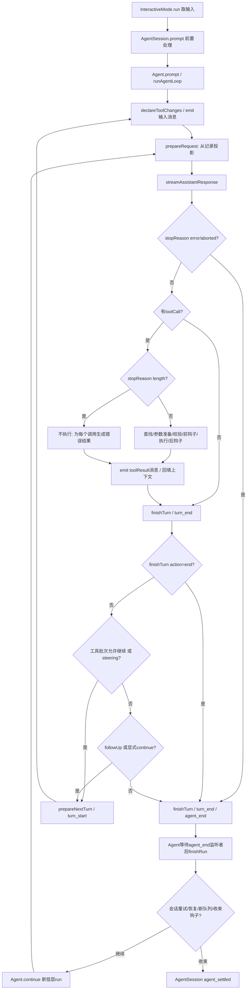

# 主链与两个静态走读例子

以下是 v1.0.2 源码条件下的静态推演，不是事件日志。正常例子前提：新会话、可用模型与认证、仅普通文本输入、`read` 已装载且可向模型声明、文件足够小、不触发压缩/重试、扩展不改消息或阻止执行、没有插队/跟进。模型第一次返回一个完整 `read` 调用，第二次返回普通文本；这是我们给定的前提，源码不保证模型这样选择。

先做 [预测问题](learning-questions.md)，需要时再读下面的解释。

## 控制流：循环和事件是两条连接



对工具结果，`hasMoreToolCalls` 的值来自批次 `terminate`，不是简单测试消息中是否还有调用。只有批次所有结果 `terminate===true` 才阻断自然工具续轮；其他队列或扩展决策仍要按源码看。`length` 分支不执行可能截断的参数，生成错误结果后仍可继续。[E15](evidence.md#e15) [E16](evidence.md#e16)

每次 `emit` 交给 `Agent.processEvents`：先更新状态，再按订阅顺序 await 监听者。会话监听者 `_handleAgentEvent` 先 await 扩展事件，再通知公开订阅者，随后在 `message_end` 追加记录。公开会话 `_emit` 没有 await 返回的 Promise；不能把 UI 的异步渲染完成等同于 Agent 订阅者结算。UI `subscribeToAgent → handleEvent` 消费事件，终端内部布局本轮不展开。[E07](evidence.md#e07) [E17](evidence.md#e17) [E03](evidence.md#e03)

## 正常例子：总结 notes.md

假设文件文本为 `# 项目\n目标：理解 agent 工具循环。`，模型调用块为 `{type:"toolCall",id:"r1",name:"read",arguments:{path:"notes.md"}}`。这些值只用于说明结构，没有创建文件或发出请求。

| 步 | 输入 → 执行者 | 条件、输出与状态归属 | 源码入口 |
|---|---|---|---|
| 1 启动 | 参数/配置 → `main` / runtime factory | 选择 interactive 模式；创建 cwd 服务、SessionManager、SDK Agent 与 AgentSession；工具在会话装载阶段设置 | `main`、`createAgentSessionServices`、`createAgentSessionFromServices`、`createAgentSession` [E02/E04](evidence.md#e02) |
| 2 用户提交 | 文本 → `InteractiveMode.run` → `AgentSession.prompt` | 非命令、非 streaming；输入 handler可处理/改写，技能/模板可展开；模型认证前置校验；构建 user message，必要时加 system sections 更新 | `prompt`、`_preparePromptAndToolLoadout` [E10](evidence.md#e10) |
| 3 进入循环 | 消息批次 → `Agent.prompt` | 创建快照和 AbortController；`runAgentLoop` 比较工具声明与可执行集合，发 agent_start、turn_start、每个初始消息的 start/end | `runPromptMessages`、`declareToolChanges` [E05/E11](evidence.md#e11) |
| 4 第一请求 | 已提交的记录投影 → `prepareRequest` / `streamAssistantResponse` | 投影保留已提交 user/system；可执行 tools保持运行时对象；transformContext→convertToLlm→normalizeContext→streamFunction；不会因文本提到 notes.md 自动带入该文件内容 | `_installAgentRequestProjection`、`streamAssistantResponse` [E08/E09](evidence.md#e09) |
| 5 模型输出 | Provider stream → 循环 | start时加入partial，delta替换工作数组尾部、发message_update；done/error取最终消息并发message_end。最终assistant含read调用；Agent和会话在此记录的是调用消息，还没有文件内容 | `streamAssistantResponse`、`processEvents` [E12/E07](evidence.md#e12) |
| 6 准备工具 | 调用r1 → `executeToolCalls` / `prepareToolCall` | 查 `context.tools` 的name；`prepareArguments`→`validateToolArguments`→`beforeToolCall`；若未阻止/取消得到prepared；默认并行，配置或任一工具sequential可使整批顺序执行 | `executeToolCalls`、`prepareToolCall` [E13](evidence.md#e13) |
| 7 本地读取 | 校验后的path → 工具 `execute` | 包装器进入read定义，解析cwd路径→ops.access→判断图片/文本→ops.readFile；默认操作使用fs/promises。小文本经截断器保留，返回 `{content:[{type:"text",text:...}],details}` | `createReadToolDefinition`、`defaultReadOperations` [E14](evidence.md#e14) |
| 8 结果封装 | tool result → 执行/后钩子/消息构造 | 捕获执行异常；afterToolCall可替换内容/错误状态；发tool_execution_end，再构造role=toolResult、toolCallId=r1、toolName=read、content、details、usage、isError、timestamp；结果消息start/end触发记录 | `executePreparedToolCall`、`finalizeExecutedToolCall`、`createToolResultMessage` [E13/E18](evidence.md#e18) |
| 9 决定下一轮 | 结果消息 → `runLoop` | 把result追加currentContext.messages/newMessages；finishTurn之后发turn_end；普通read不terminate，因此进入下一轮；prepareNextTurn可能刷新工具/压缩，下一次prepareRequest重新从记录投影 | `runLoop`、`_installAgentNextTurnRefresh` [E15/E19](evidence.md#e19) |
| 10 第二请求/总结 | 含调用+结果的投影 → 模型层 | 前提没有投影编辑/压缩时，保留user、assistant调用、toolResult；文件正文首次经toolResult提供。模型返回普通text；无自然工具续轮且无队列/显式continue时低层结束 | `streamAssistantResponse`、`runLoop` [E09/E15](evidence.md#e15) |
| 11 收束/消费 | agent_end → Agent/会话/UI | Agent等待监听者后清理activeRun；会话post-run检查未要求继续，finally发agent_settled；终端已沿途消费消息事件，而非到最后才收到全部输出 | `finishRun`、`_runAgentPrompt`、`_emitAgentSettled` [E20/E21](evidence.md#e20) |

本例只展示 read 一个调用；并行多工具的结束事件可按完成顺序发出，但结果消息按源码调用顺序提交。这个区别由 `Promise.all` 和遍历顺序可见，测试写有对应预期，本轮未运行。[E13](evidence.md#e13) [T03](evidence.md#t03)

## 两次请求的数据变化

以 `S` 代表系统正文/sections和工具声明，不固定它恰好有几条 system 消息：

```text
请求1逻辑消息：S* → user("总结 notes.md")
完成调用消息：assistant([toolCall r1:read(path=notes.md)])
本地结果消息：toolResult(r1, content=[text(文件正文)], isError=false)
请求2逻辑消息：S* → user → assistant(toolCall r1) → toolResult(r1)
最终完成消息：assistant([text(总结)])
```

新会话 SDK 创建 Agent 时 `systemPrompt:""`、`tools:[]`，应用随后生成sections并装载工具；`declareToolChanges` 可合并到pending system，或者在首个非system前插入delta。独立调用低层loop时，已有system基线又可能使消息数量不同。因此不能沿用旧实验的“固定两个system”作为本版CLI契约。[E04](evidence.md#e04) [E11](evidence.md#e11)

`normalizeContext({messages:llmMessages})` 本身不会无条件添加system；只有传入非空 `systemPrompt` 或 `tools` 才创建leading message。本主链已把这些信息放进transcript。`convertToLlm` 可把custom/bash/summary转换成user，不能把内部role直接当作provider协议。provider还会根据支持的system/tool变化转换transcript；本轮没有捕获实际网络载荷。[E09](evidence.md#e09)

## 记录更新在哪里发生

```text
输入system/user的message_end → Agent追加完成消息 → 会话appendMessage
assistant调用的message_end  → Agent追加完成消息 → 会话appendMessage
每个toolResult的message_end → Agent追加完成消息 → 会话appendMessage
最终assistant的message_end  → Agent追加完成消息 → 会话appendMessage
```

`SessionManager.appendMessage` 生成条目id、parentId，推进leaf；原始记录不是简单的平铺请求数组。`_persist` 只有 `persist` 和 `sessionFile` 都有效才写文件；新的会话在首次user或assistant条目出现时创建并flush已有条目，后续追加JSONL。模型/thinking/setup条目单独存在时可以只留内存。这里描述源码的写入条件，不声称本轮观测了落盘。[E17](evidence.md#e17) [E23](evidence.md#e23)

## 对照例子：文件不存在

保持同样模型调用前提，只把目标换为不存在的文件。`ops.access` 或读操作拒绝，read定义把错误reject；`executePreparedToolCall` catch把错误文本封装成错误tool result。后钩子若不替换错误，则消息 `toolResult.isError=true`，且 `toolCallId` 仍匹配r1。[E14](evidence.md#e14) [E18](evidence.md#e18)

**工具失败通常不会直接使整个低层循环结束。** 结果仍经过消息事件与记录追加；普通错误result没有terminate，模型可以收到错误再回答或重新调用。第二次回答的措辞完全取决于给定模型输出，源码没有固定“文件不存在”的最终回复。read单元测试写有ENOENT拒绝的预期，低层测试写有失败→isError封装的预期；这些测试未在本轮执行。[T02](evidence.md#t02) [T04](evidence.md#t04)

对照正常例子，发生变化的是执行结果和toolResult的content/isError；用户消息、调用id匹配、后续投影和事件连接仍沿同一主链。不要把 read函数reject与Agent.prompt最终reject视为同一错误层级。

## 各种出口

| 情形 | 低层处理 | 应用层与后续条件 |
|---|---|---|
| 普通文本stop | 无工具、无steering/followUp、无finishTurn continue → agent_end | post-run无重试/恢复/新队列/收束继续 → agent_settled；交互进程仍等待下个输入 |
| 未找到工具/参数非法/前钩子阻止 | immediate错误，跳过execute；被block的调用不进入afterToolCall | 普通错误仍回填；显式terminate按整批规则影响续轮 |
| read执行抛错 | catch错误→afterToolCall→isError工具消息 | 通常继续模型请求，区别于模型响应error |
| assistant stopReason=length且含调用 | 所有调用都不执行，发错误结果 | 下一轮可重发完整调用；应用层也有长度恢复支线 |
| assistant stopReason=error/aborted | 不执行其toolCall，finishTurn，turn_end，agent_end后return | 会话根据错误分类/重试预算/取消标记决定是否再continue |
| streamFn/监听等run执行抛错 | Agent.runWithLifecycle catch进入handleRunFailure，合成assistant error/aborted和结束事件 | 该兜底不代表所有监听异常都一定能安全恢复；嵌套回调再次抛错要另行分析 |
| 用户取消 | Session.abort取消重试/压缩/摘要；Agent.abort触发signal，waitForIdle | 取消是协作信号，不保证中断底层OS读取；read拒绝/忽略后续完成，不能声称已撤销所有副作用 |

上述条件详见 [E13/E15/E16/E20/E21/E22/E24](evidence.md#e24)。压缩、插队、扩展和重试的接入点已保留，算法不在此展开；[后续支线](expansion-backlog.md) 记录状态归属与下一步问题。
