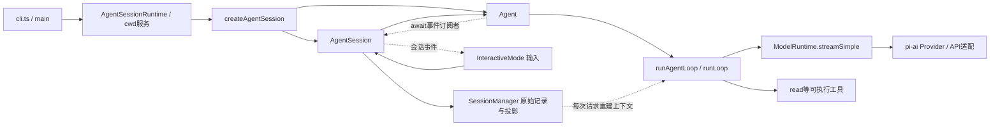

<!-- Derived from graphify-out/architecture.md; edit the Markdown source and re-export. -->

# 全仓职责与关键连接

适用版本和证据规则见 [README](README.md)。以下包地图来自各包 manifest、README 和结构提取；运行主链经源码另行确认。每个包版本均为 1.0.2，根 workspace 的私有版本另为 0.0.3，不能把根版本当作 Pi 产品版本。[E01](evidence.md#e01)

## 从终端入口看核心分工

这里的箭头分别标出调用、事件订阅和上下文投影，不能当成一条线性执行顺序。`main` 不直接调用 `runAgentLoop`；它先组合服务与运行时，通过 `createAgentSessionFromServices` 进入 SDK。`InteractiveMode.run` 的普通输入先从 `getUserInput` 取出，再交给 `session.prompt`；编辑器提交只是输入接入的一端。[E02](evidence.md#e02) [E03](evidence.md#e03)

`AgentSession` 负责应用规则：输入拦截、技能/模板展开、工具装载、请求投影、会话记录、重试/压缩与扩展边界。`Agent` 负责当前消息状态、运行信号、两种队列、事件归约与订阅。低层循环负责一轮请求和工具批次，以及是否继续。`ModelRuntime` 把模型选择、认证与 provider 组合起来；provider/API 适配才把 Pi 消息转换成具体协议。[E04](evidence.md#e04) [E05](evidence.md#e05) [E09](evidence.md#e09)

## 13 个包的地图

路径均相对 Pi 仓库。依赖列是 `package.json` 中的直接 workspace **运行依赖**，不包括 devDependencies，也不等于实际调用顺序。[E01](evidence.md#e01)

| 包 | 提供的职责 / 主要入口 | 直接运行依赖 / 边界 |
|---|---|---|
| `coding-agent` | CLI、会话、资源/配置、扩展、内置工具；`src/cli.ts`、`src/core/sdk.ts` | chord、agent、ai、codemode、mcp、tui；本轮深入主链 |
| `agent` | 可嵌入的 Agent 和循环；`src/agent.ts`、`src/agent-loop.ts` | ai；通过注入 `streamFn` 使用模型，不需要 CLI |
| `ai` | 消息、工具声明、模型/认证、provider/API；`src/types.ts`、`src/models.ts`、`src/api/` | telemetry；供应商协议仅保留入口 |
| `tui` | 终端组件、差异渲染、输入；`src/index.ts` | 无 Pi 运行依赖；只追踪输入输出消费边界 |
| `codemode` | 受限 JavaScript 执行、注入工具能力；`src/runtime/host.ts` | 无 Pi 运行依赖；不是主循环替代品 |
| `mcp` | 独立 MCP 客户端、stdio/HTTP transport；`src/index.ts` | 无 Pi 运行依赖；主应用可将远端工具接入装载机制 |
| `telemetry` | 遥测契约与类型化 schema；`src/index.ts` | 无 Pi 运行依赖；不控制工具执行 |
| `chord` | 服务、facet、插件组合与复制状态；`src/index.ts` | 独立通用库，无其他 Pi 运行依赖 |
| `durable` | 持久 conversation/document/task 与 Harness；`README.md`、`src/index.ts` | chord、ai；有另一条持久任务架构，不能直接套成本轮 CLI AgentSession |
| `protocol` | 远程会话的 CBOR/封帧协议；`src/index.ts` | chord；传输/路由边界 |
| `client` | 传输中立的远程客户端；`src/client.ts` | chord、protocol；远程会话入口 |
| `server` | 实验服务器、附着路由和会话 capability；`src/index.ts` | chord、protocol；应用拥有 durable Session/Harness，服务器不搬运活 JavaScript 对象 |
| `evals` | 行为评估、host 与文档对照 runner；`src/cli.ts`、`src/harness.ts` | 无直接 Pi 运行依赖（另有开发依赖）；本轮只读，未运行 |

结构图也覆盖 `scripts/`、测试、示例、`.pi/` 和 `.github/` 中支持的文件。构建/发布脚本是维护边界，不是用户请求的中间步骤。完整入图/未提取路径在 `coverage.json`，不能用表中“有入口”代替逐文件覆盖。

## 三份容易混淆的数据

| 数据 | 所有者与变化 | 用来回答什么问题 |
|---|---|---|
| 原始会话条目 `fileEntries/byId/leafId` | `SessionManager` 追加树形条目，含 model/thinking、message、context_edit、压缩等；可配置持久化 | 历史实际记录了什么、在哪个分支 |
| Agent 状态 `state.messages`、`streamingMessage`、`pendingToolCalls` | `Agent.processEvents` 归约事件；最终上下文可被会话投影刷新 | 当前消息/执行中状态是什么 |
| 本次请求 `currentContext → llmContext → provider payload` | 会话 `prepareRequest` 用记录投影；循环执行 transform/convert/normalize；API 构造具体协议 | 这次请求逻辑上能看到什么 |

循环 `currentContext.messages` 是快照/工作数组，和 Agent 状态数组不是同一个顶层数组；消息对象可能共享。流式 partial 先进入循环工作上下文，Agent 则用 `streamingMessage` 暂存；只有 `message_end` 才追加 Agent 的完成消息。会话监听同一事件追加原始条目，然后下一次请求的投影可从这些条目重建。[E06](evidence.md#e06) [E07](evidence.md#e07) [E08](evidence.md#e08)

## 设计取舍：事实与推断

**事实**：Agent 构造参数接受 `streamFn`，SDK 实际注入 `ModelRuntime.streamSimple`；包 manifest 里 agent 不依赖 coding-agent。**推断**：这个接缝让低层控制流可独立嵌入和以固定响应测试；代价是应用层要维护投影、工具装载与生命周期约定。测试文件给出这种用法，但本轮没有验证它运行成功。[E05](evidence.md#e05) [T01](evidence.md#t01)

**事实**：`buildSessionProjection` 保留 `sourceEntry`、按当前 leaf、压缩与 context_edit 生成请求消息。**推断**：原始记录和请求视图分离能保留错误尝试，同时让重试避开失败输出；维护者必须判断一个修改是在改历史、改投影还是只改本次请求。[E08](evidence.md#e08) [E22](evidence.md#e22)

后续比较 durable Harness 与 CLI Agent 的分工时，从这两个具体状态边界开始，不根据包名推断它们已经互相替换。支线入口见 [扩展清单](expansion-backlog.md)。
